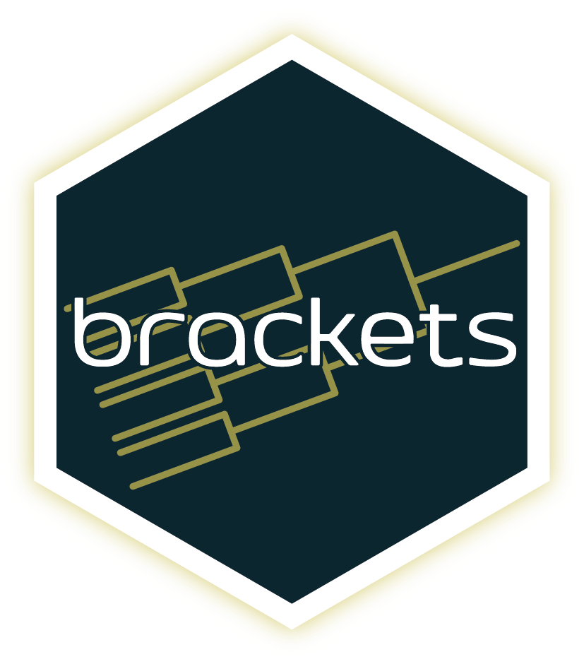

# brackets 

> Wrapper around [brackets-viewer.js](https://github.com/Drarig29/brackets-viewer.js): a simple library to display tournament brackets. Display round-robin, single elimination and double elimination tournaments in R or Shiny.

## Installation

You can install the package from GitHub:

```         
pak::pak("hypebright/brackets")
```

## Data

The data needed for the tournament brackets is a list of participants and a list of matches. The data follows the [brackets-model](https://drarig29.github.io/brackets-docs/reference/model/).

## Usage

Above mentioned data is essential for using `brackets` effectively. The following example shows how to create a simple tournament bracket and show the results in a Shiny application ✨:

```r
library(brackets)
library(shiny)

tennis_data <- list(
  participant = list(
    list(id = 0, tournament_id = 0, name = "🇱🇻 Jelena Ostapenko"),
    list(id = 1, tournament_id = 0, name = "🇺🇸 Coco Gauff"),
    list(id = 2, tournament_id = 0, name = "🇷🇴 Sorana Cirstea"),
    list(id = 3, tournament_id = 0, name = "🇨🇿 Karolina Muchova"),
    list(id = 4, tournament_id = 0, name = "🇨🇿 Marketa Vondrousova"),
    list(id = 5, tournament_id = 0, name = "🇺🇸 Madison Keys"),
    list(id = 6, tournament_id = 0, name = "🇨🇳 Zheng Qinwen"),
    list(id = 7, tournament_id = 0, name = "🇧🇾 Aryna Sabalenka")
  ),
  stage = list(
    list(
      id = 0,
      tournament_id = 0,
      name = "US Open 2023 (Finals) 🎾",
      type = "single_elimination",
      number = 1,
      settings = list(
        size = 8,
        seedOrdering = list("natural"),
        grandFinal = "simple",
        matchesChildCount = 0
      )
    )
  ),
  round = list(
    list(id = 0, number = 1, stage_id = 0, group_id = 0),
    list(id = 1, number = 2, stage_id = 0, group_id = 0),
    list(id = 2, number = 3, stage_id = 0, group_id = 0)
  ),
  match = list(
    list(
      id = 0,
      number = 1,
      stage_id = 0,
      group_id = 0,
      round_id = 0,
      child_count = 0,
      status = 4,
      opponent1 = list(id = 0, position = 20, score = 0, result = "loss"),
      opponent2 = list(id = 1, position = 6, score = 2, result = "win")
    ),
    list(
      id = 1,
      number = 2,
      stage_id = 0,
      group_id = 0,
      round_id = 0,
      child_count = 0,
      status = 3,
      opponent1 = list(id = 2, position = 30, score = 0, result = "loss"),
      opponent2 = list(id = 3, position = 10, score = 2, result = "win")
    ),
    list(
      id = 2,
      number = 3,
      stage_id = 0,
      group_id = 0,
      round_id = 0,
      child_count = 0,
      status = 0,
      opponent1 = list(id = 4, position = 9, score = 0, result = "loss"),
      opponent2 = list(id = 5, position = 17, score = 2, result = "win")
    ),
    list(
      id = 3,
      number = 4,
      stage_id = 0,
      group_id = 0,
      round_id = 0,
      child_count = 0,
      status = 2,
      opponent1 = list(id = 6, position = 23, score = 0, result = "loss"),
      opponent2 = list(id = 7, position = 2, score = 2, result = "win")
    ),
    list(
      id = 4,
      number = 1,
      stage_id = 0,
      group_id = 0,
      round_id = 1,
      child_count = 0,
      status = 3,
      opponent1 = list(id = 1, score = 2, result = "win"),
      opponent2 = list(id = 3, score = 0, result = "loss")
    ),
    list(
      id = 5,
      number = 2,
      stage_id = 0,
      group_id = 0,
      round_id = 1,
      child_count = 0,
      status = 1,
      opponent1 = list(id = 5, score = 1, result = "loss"),
      opponent2 = list(id = 7, score = 2, result = "win")
    ),
    list(
      id = 6,
      number = 1,
      stage_id = 0,
      group_id = 0,
      round_id = 2,
      child_count = 0,
      status = 0,
      opponent1 = list(id = 1, score = 2, result = "win"),
      opponent2 = list(id = 7, score = 1, result = "loss")
    )
  ),
  match_game = list()
)

ui <- fluidPage(
  titlePanel("Tennis Tournament Bracket"),
  bracketsViewerOutput("bracket")
)

server <- function(input, output) {
  output$bracket <- renderBracketsViewer({
    bracketsViewer(tennis_data)
  })
}

shinyApp(ui, server)

```

## Acknowledgements

Thanks to [Corentin Girard](https://github.com/Drarig29) for creating the underlying `brackets` libraries.

Related documentation:

-   [brackets-docs](https://drarig29.github.io/brackets-docs/)
-   [brackets-viewer.js](https://github.com/Drarig29/brackets-viewer.js?tab=readme-ov-file)
